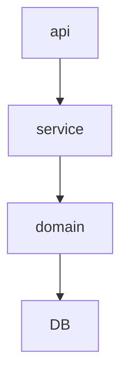

   # FastAPI로 게시글 REST API 서버 구현하기 #

## FastAPI로 게시글 생성 및 조회, 수정 삭제가 가능한 엔드포인트를 구현하였습니다. ##

***
#### requirements ####
python 3.10.0

fastapi 0.0.4
***
 
### - install ###
window OS 를 사용하는 PC에 대한 install 방법입니다.

#### pyenv-win 설치 ####
```
    Invoke-WebRequest -UseBasicParsing -Uri https://pyenv.run | Invoke-Expression
```

#### python 버전 설치 및 설정 ####
```
    pyenv install 3.10.0
    pyenv global 3.10.0
```

#### poetry 설치 ####
```
    (Invoke-WebRequest -Uri https://install.python-poetry.org -UseBasicParsing).Content | python -
```

#### Poetry 프로젝트 초기화 ####
```
    poetry init --no-interaction
```

#### FastAPI 및 Uvicorn 설치 ####
```
    poetry add fastapi uvicorn
```

### - 실행 ###

#### Poetry 쉘 활성화 ####
```
    poetry shell
```

####  FastAPI 애플리케이션 실행 ####
```
    uvicorn main:app --reload
```

####  FastAPI 애플리케이션 실행 ####
```
    127.0.0.1:8000/docs <- 주소로 이동 후 
```

#### 설명 ####
FastAPI-Swagger UI를 통해 REST API를 실행할 수 있습니다.
예를들어 HTTP POST 요청을 /posts/ 경로로 처리합니다,
사용자가 /posts/ 경로로 POST 요청을 보내면 create_post 함수가 동작합니다.
RequestPost 모델 타입의 post 매개변수를 입력으로 받고
JSON 형식의 데이터를 파싱하여 RequestPost 모델로 변환합니다.
게시글은 딕셔너리에 저장되며 키는 id_counter, 값은 ResponsePost 객체입니다.

#### 계층도 ####


* * *

* * *

* * *

* * *
