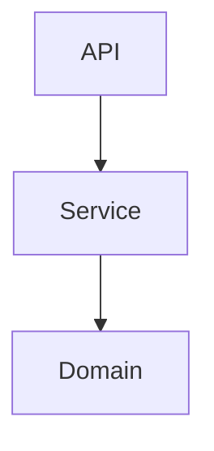

# FastAPI로 구현한 게시글 REST API Server

게시글을 작성, 추가, 조회할 수 있는 간단한 게시판 REST API 서버입니다.

계정 생성을 통해 생성된 계정으로 게시글 작성, 조회, 수정, 삭제를 할 수 있습니다.  
계정 인증방식은 세션 인증 방식을 사용하였고, 일반 사용자와 관리자 두 개의 Role이 있습니다.  
게시글의 수정, 삭제는 게시글을 작성한 본인과 관리자만이 가능합니다. 

게시글에 대한 댓글 작성, 조회, 수정, 삭제 기능도 구현하였습니다.  
댓글도 마찬가지로 수정, 삭제는 댓글을 작성한 본인과 관리자만 가능합니다.

유저 정보에 대한 수정 및 삭제 또한 유저 본인이거나 관리자만 가능합니다.

## Requirements 

- python >= 3.10.0
- poetry >= 1.8.3

## How to install

```bash
poetry install
```

## How to run

```bash
docker-compose up -d
```

## What you can do

After run server, please visit following url (Swagger UI)

```
127.0.0.1:8000/docs (http://localhost:8000/docs) # Swagger UI로 API 호출 테스트
```

## Architecture



## How to develop

```
docker-compose up -d -f docker-compose.dev.yaml
uvicorn main:app --reload
```

## How to test

```bash
test

# 커버리지 측정 
test --cov 
```

## How to build

```bash
docker build -t sfdg4869/my-fastapi-app:latest .

# or

docker-compose up --build 
```
