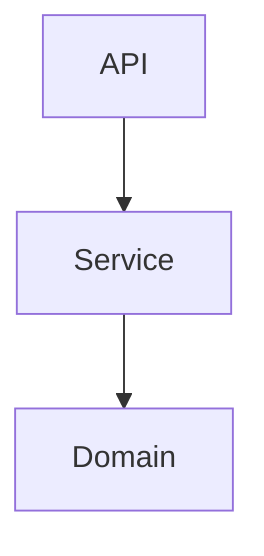

# FastAPI로 게시글 REST API 서버 구현하기

# TODO: 리드미 업데이트. 처음 보는 사람도 설치하고 실행하고, 테스트 할 수 있도록. 친절하게.

## FastAPI 기능설명 
인증된 유저로 게시글, 댓글을 작성할 수 있고 게시글, 유저, 댓글의 수정은 본인과 관리자만 가능함
***
### requirements 
python <= 3.10.0

poetry <= 0.1.0
***
 
### execution
```bash
poetry shell
```

```bash
uvicorn main:app --reload
```

```bash
127.0.0.1:8000/docs
```
### docker execution
```bash
docker pull sfdg4869/my-fastapi-app:latest
```

```bash
docker-compose up -d
```
### explanation
계정 생성을 통해 생성된 계정으로 게시글 작성, 조회, 수정, 삭제를 할 수 있는 endpoint를 구현하였습니다.
계정 인증방식은 세션 인증 방식을 사용하였고, 일반 사용자와 관리자 두 개의 Role이 있습니다.
게시글의 수정, 삭제는 게시글을 작성한 본인과 관리자만이 가능합니다. 

게시글에 대한 댓글 작성, 조회, 수정, 삭제 기능도 구현하였습니다. 
댓글도 마찬가지로 수정, 삭제는 댓글을 작성한 본인과 관리자만 가능합니다.

유저 정보에 대한 수정 및 삭제 또한 유저 본인이거나 관리자만 가능합니다.

### hierarchy

### screen shot


